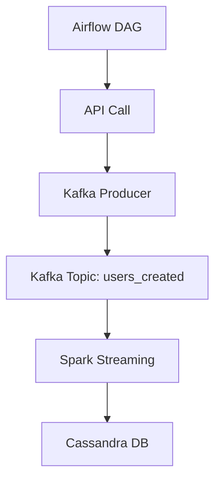

# 🧠 Real-Time User Data Streaming Pipeline

This project builds a real-time data engineering pipeline that ingests user data from an external API, streams it via Kafka, processes it with Spark, and stores it in Cassandra.

---

## 🚀 Tech Stack

- **Apache Kafka (KRaft mode)** – Real-time data streaming
- **Apache Airflow** – Task orchestration
- **Apache Spark Structured Streaming** – Real-time data processing
- **Apache Cassandra** – Scalable NoSQL data storage
- **Docker & Docker Compose** – Containerization
- **Python** – Scripting and API interaction

---

## 📦 Architecture Overview



---

## 🛠️ How It Works

1. **Airflow DAG** triggers a Python task that fetches user data from `https://randomuser.me/api/`.
2. The data is formatted and sent to a Kafka topic (`users_created`).
3. **Spark Structured Streaming** reads from Kafka, parses the JSON payload, and writes it to Cassandra.
4. Cassandra stores the data in a table `created_users` under keyspace `spark_streams`.

---

## 📁 File Structure

```
.
├── kafka_stream.py       # Airflow DAG for data ingestion
├── spark_stream.py       # Spark job for real-time processing
├── docker-compose.yml    # Container orchestration
├── README.md             # Project documentation
```

---

## 🧪 Run Locally

1. Clone the repo:
   ```bash
   git clone https://github.com/yourusername/user-streamer.git
   cd user-streamer
   ```

2. Start services:
   ```bash
   docker-compose up
   ```

3. Trigger Airflow DAG manually or wait for scheduled run.

---

## 📊 Sample Output

```json
{
  "id": "uuid",
  "first_name": "John",
  "last_name": "Doe",
  "gender": "male",
  "address": "123 Main St, City, State, Country",
  "email": "john.doe@example.com",
  "username": "johndoe123",
  "dob": "1990-01-01",
  "registered_date": "2020-01-01",
  "phone": "123-456-7890",
  "picture": "https://randomuser.me/api/portraits/med/men/1.jpg"
}
```

---

## 📌 Notes

- Kafka runs in **KRaft mode**, eliminating the need for Zookeeper.
- Spark uses **checkpointing** for fault tolerance.
- Cassandra keyspace and table are created automatically.

---


```
